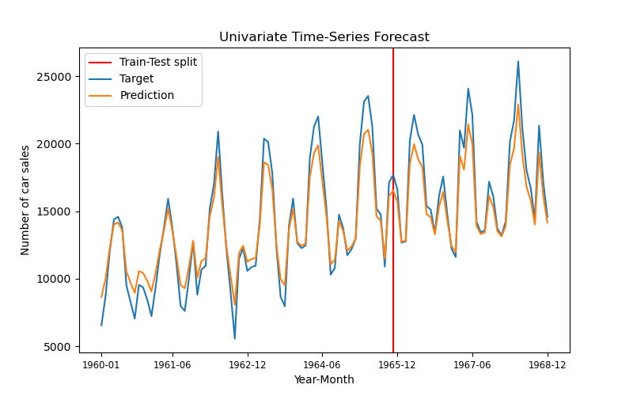

# Univariate Time Series Forecasting of Car Sales

## Project description
The goal of the project was forecasting the next month's number of car sales by using information about number of car sales in the previous months.

## Dataset 
The dataset is stored as a **csv** file [monthly-car-sales.csv](src/data/) downloaded from [Datasets repository](https://github.com/jbrownlee/Datasets) provided by [jbrownlee](https://github.com/jbrownlee). Dataset consists of 108 months from January 1960. up to December 1968.

### Visualization of the dataset


### Data preprocessing

The dataset consists of two columns:
1. Date in the year-month format
2. Number of car sales in the according month

Number of car sales feature was extracted and prepared for the RNN model by dividing the dataset into input-output pairs. Input consists of values of car sales in three consecutive time steps, while the target output is the number of car sales in the next consecutive month. Default value of time lag(length of each input example) is three as previously mentioned but it can be modified in the **lag** argument of the *ArgumentParser* object in the [globals.py](src/globals.py) file. With this approach (and these hyperparameters) we created a dataset with 104 input-output pairs.

### Train-Evaluation split
Previously created subsequences were split into train and test set with 0.65 split ratio. This hyperparameter can be modified the same way as time lag, in the [globals.py](src/globals.py) file.

## Model
The model consists of a single layer LSTM and a fully connected layer. The hidden cells values of the last layer of LSTM are fed into a FC layer which has a linear activation.

**LSTM layer architecture:**
| Input dim.      | Embedding dim. | Number of layers. |
| :-------------: | :-------------: | :-------: |
|     1      | 2       | 1       |

**Weight init**

For the linear layer Uniform Kaiming initialization was used. It resulted in faster convergence than using the default PyTorch initialization for the linear layer. 

## Training
The model was trained for **1500 epochs** using Google Colab. **Adam optimizer** was used with **learning rate of 5e-4** and slight **L2 regularization**.
Along with that **Mean Absolute Error (L1 loss)** function was used. In the training process it showed better results (regarding the convergence) than the Mean Squared Error. Most of the previously mentioned hyperparameters can be modified in the [globals.py](src/globals.py) file.

### Loss
On the image bellow we can see train and test losses (MAE) during training. Train and test sets weren't split into batches during training or evaluation.


## <a name="eval_res"></a> Evaluation Results
On the image below we can see that evaluation on the entire dataset. 



The model is succesfull in estimating the position of the peaks and increasing trend of the sequence, but has difficulty in estimating the exact values of the sequence. With respect to that bellow we can see table with final evaluation metrics.


| Total MAE. | Test MAE. |
| :-------------: | :-------------: |
| 1230.9681    | 1453.2430  |


## Setup & instructions
1. Open Anaconda Prompt and navigate to the directory of this repo by using: ```cd PATH_TO_THIS_REPO ```
2. Execute ``` conda env create -f environment.yml ``` This will set up an environment with all necessary dependencies. 
3. Activate previously created environment by executing: ``` conda activate car-sales-forecast ```
4. Training and/or testing the model.

    a) If you want to train the model you should execute: ``` python src/main.py --mode train ```. This will load and prepare the dataset and start training it with default values of the hyperparameters which can be found in the [globals.py](src/globals.py) file. You can change them directly in the script or via command line. Example: ``` python src/main.py --mode train --lr 3e-2``` will start the script in the train mode with learning rate set to 3e-2. The model will then be evaluated on the entire set.
    
    b) If you don't want to train the model you can use model pretrained by me by executing: ``` python src/main.py ``` which will automatically load and prepare the dataset, instantiate the model, load the pretrained model and evaluate it as demonstrated above in [Evaluation results](#eval_res). Mode argument has default value of "eval" so running former code is same as explicitly saying ``` python src/main.py --mode eval```. If you use any of these two approaches you can set other arguments as well, but most of them will be ignored considering we are not training the RNN, we are just evaluating it. Split ratio is the only argument which would have effect, but only when evaluating test set MAE.
    
